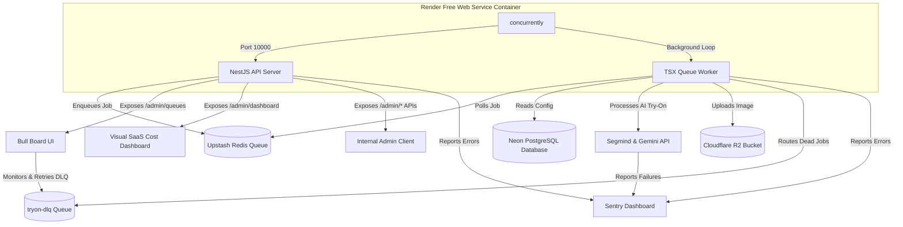

# Architecture — AI Virtual Try-On SaaS Platform

> Plug-and-play Shopify widget. Fully multi-tenant. No Docker required. Incorporating enterprise-grade security, DLQ worker reliability, Sentry APM tracking, and multi-tiered Redis caching.

---

## Platform Overview

Two independent plug-and-play features share the same infrastructure:

| Feature | What it does | Widget trigger |
|---|---|---|
| **AI Virtual Try-On** | Customer uploads photo → AI renders them wearing the product | `TryOnWidget.init()` |
| **Size Intelligence** | Customer answers questions → AI recommends the right size | `SizeWidget.init()` (separate spec) |

A brand opts into one or both. Both features resolve the same tenant config, use the same auth, same database, same queue. Zero shared state between pipelines.

---

## Design Decisions & Enhancements

| Component | Design Strategy | Benefit |
|---|---|---|
| **Client Resizing** | Headless HTML Canvas `toDataURL('image/jpeg', 0.85)` | Shrinks uploads from 5MB to ~150KB, reducing transmission time by 20x. |
| **Multi-Tier Caching** | Redis caching for static product metadata and full JSON response payloads | Bypasses database queries during heavy widget status polling. |
| **Worker DLQ & Retries** | BullMQ retry backoff with local `withRetry` wrappers + `'tryon-dlq'` dead-letter queue routing | Guarantees worker reliability against Segmind timeouts and R2 glitches. |
| **Security Hardening** | Global sanitization, binary magic-byte validations, dynamic CORS rules | Secures compute GPU resources from spammers and injection vectors. |
| **Centralized APM** | `@sentry/nestjs`, `@sentry/node` + Sentry browser integration | Live operational error mapping and transaction trace tracking. |

---

## Cost Optimization Strategy

Every AI call costs money. This table shows every cost cut made and why:

| Decision | Saving | Detail |
|---|---|---|
| Gemini Flash instead of OpenAI | ~100% on compliments | Free up to 1,500 req/day; $0.10/1M tokens after. |
| Client-Side Canvas Compression | 95% on network upload | Resizes to max 1024px, JPEG 85% in client browser before upload. |
| Cache product metadata | Saves DB connection pools | Same garment → cached in Redis for 10 minutes. |
| Poll results out of Redis cache | Saves PostgreSQL read cost | Completed status response payload cached in Redis for 180s. |
| Delete user uploads after 24h | R2 storage costs | Selfies are deleted automatically daily by cron worker. |
| Delete generated images after 7 days | R2 storage costs | Finished assets purged automatically after 1 week. |

---

## Infrastructure Layer Configuration

| Layer | Service | Cost | Why |
|---|---|---|---|
| Runtime | Render/Railway Container | Free / Starter | Git push auto-deploy, zero Docker config |
| Database | Neon serverless PostgreSQL | Free | Serverless Postgres with Prisma client |
| Queue / Cache | Upstash Redis | Free | 10,000 requests per day free tier |
| Object Store | Cloudflare R2 | Free | 10GB storage, 100% free egress bandwidth |
| CDN Delivery | Cloudflare Pages | Free | Global edge hosting for storefront bundles |
| Exception APM | Sentry | Free | 5,000 events/month, comprehensive alert metrics |

---

## 📈 System Architecture & Flow Diagram

---

## Multi-Tiered Caching Rules

| Key | TTL | Cached Object | Cost impact |
|---|---|---|---|
| `tenant:{id}:config` | 5 min | Branding styles & AI models | Eliminates DB configuration queries. |
| `product:{tenantId}:{productId}` | 10 min | Static product garment coordinates | Reduces Neon connection pools under load. |
| `tryon:{requestId}:response` | 3 min | Complete `TryonStatusResponse` payload | Enables database-free widget polling. |
| `compliment:{tenantId}:{productId}:{tone}` | 24 hr | Styling compliment & scores | Saves Gemini Flash API text limits. |

---

## Security Specifications Matrix

| Threat Vector | Mitigation Strategy | Implementation |
|---|---|---|
| **CORS Spoofing** | Dynamic allowed origins | Blocks unauthorized client integrations, allows configured Shopify stores. |
| **Click / Script Spam** | Multi-Tier Redis Rate Limiting | `burst` (2 req/s) and `tryon` limits coordinates atomically via Redis. |
| **XSS & SQL Injection** | Global recursive input sanitizer | Crawls request parameters, sanitizes script tags, and escapes HTML characters. |
| **Payload Executables** | Binary magic-byte header validation | Decodes JPEG/PNG magic signatures before queueing. |
| **Timing Side-Channels** | Timing-Safe HMAC matching | Utilizes Node's `crypto.timingSafeEqual` for secure Shopify webhook parsing. |
